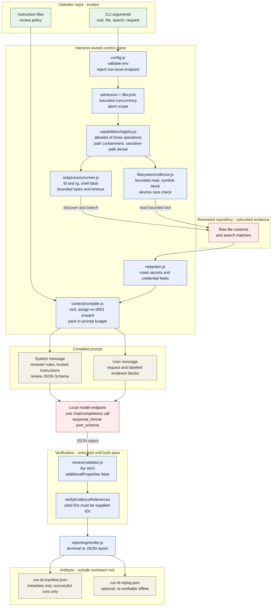

# Architecture

## Ownership boundaries

- **CLI boundary (`src/cli.js`)**: argument parsing, signal wiring, and terminal IO.
- **Composition root (`src/harness.js`)**: dependency wiring and runtime configuration.
- **Orchestration (`src/orchestrator/*`)**: review workflow and replay workflow.
- **Admission/lifecycle (`src/admission`, `src/lifecycle`)**: bounded concurrency, queueing, shutdown.
- **Capabilities/policy (`src/capabilities`)**: approved operation names, input validation, policy denial.
- **Filesystem collection (`src/filesystem`)**: deterministic discovery/search/read with limits.
- **Subprocess execution (`src/subprocess`)**: timeout/cancellation, bounded output, structured exits.
- **Redaction (`src/redaction`)**: sensitive value/field masking before model or persistence.
- **Context compilation (`src/context`)**: deterministic evidence inclusion and omission tracking.
- **Model provider (`src/model`)**: OpenAI-compatible HTTP transport boundary.
- **Review contract (`src/review`)**: strict schema validation and evidence-reference verification.
- **Reporting (`src/reporting`)**: terminal/JSON render transformation.
- **Audit persistence (`src/audit`)**: sanitized manifests and optional replay bundles.

## Trust boundaries

Three classes of input meet in a review run, and the harness keeps them apart:

| Class              | Origin                                                   | Treatment                                                |
| ------------------ | -------------------------------------------------------- | -------------------------------------------------------- |
| Trusted policy     | Instruction files named explicitly with `--instructions` | System message; read as review rules.                    |
| Untrusted evidence | Repository file contents and search matches              | User message; labelled, quoted, and never read as rules. |
| Harness-owned      | Limits, redaction, validation, artifacts                 | Not reachable by repository content or model output.     |

The model holds no capabilities. It is invoked once per run with a frozen prompt and returns one JSON object. Every filesystem and subprocess operation happens before that call, under harness control, so model output cannot widen collection scope or trigger further work.

## Review pipeline

Reading the diagram:

- Green is operator intent, the only input the harness treats as instructions.
- Red is untrusted: repository content on the way in, model output on the way out. Both cross into blue only through a checking step.
- Blue is harness-owned. Nothing in red can change how blue behaves.
- The two gates are independent. Schema validity does not imply honest evidence citation, so `E_REVIEW_SCHEMA_INVALID` and `E_UNKNOWN_EVIDENCE_REFERENCE` are separate failures.
- Failures anywhere before the gates leave no manifest, so a manifest on disk always denotes a run that passed both gates.
- Replay re-enters at the gates: `src/orchestrator/replay.js` re-runs both checks against a stored bundle with no model call.

## Workflow

1. Validate runtime config and operator-selected root.
2. Collect bounded evidence via approved filesystem capabilities.
3. Load trusted instruction files explicitly provided by operator.
4. Compile bounded prompt with stable evidence identifiers.
5. Invoke configured local-compatible model endpoint, requesting output constrained to the review schema.
6. Validate response against strict schema version.
7. Verify model evidence references only target supplied evidence IDs.
8. Render report.
9. Persist sanitized manifest (and optional replay bundle) outside reviewed root.
10. Release request slot and resources.

## Determinism goals

- Sorted evidence ordering.
- Stable IDs (`ev-0001`, ...).
- Explicit omission metadata when budgets truncate context.
- Stable error codes for automated tests and integration callers.

## Deferred boundaries

Not implemented in milestone one: Git diff review, infrastructure CLI adapters, Copilot integration, MCP transport, API server, model-driven tool loops, multi-model evaluation, write-capability workflows.
