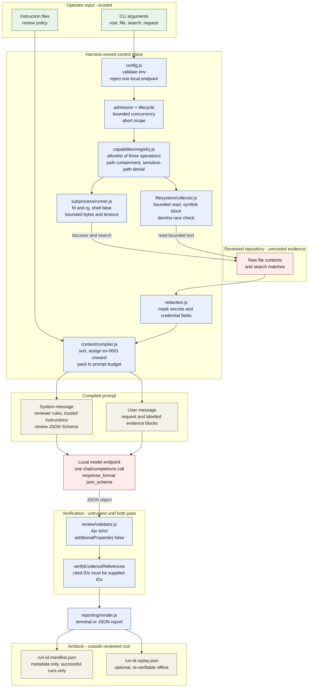

# Architecture

## Ownership boundaries

- **CLI boundary (`src/cli.js`)**: argument parsing, signal wiring, and terminal IO.
- **Composition root (`src/harness.js`)**: dependency wiring and runtime configuration.
- **Orchestration (`src/orchestrator/*`)**: single-pass review, opt-in investigation, and offline replay.
- **Admission/lifecycle (`src/admission`, `src/lifecycle`)**: bounded concurrency, queueing, shutdown.
- **Capabilities/policy (`src/capabilities`)**: approved operation names, input validation, policy denial.
- **Filesystem collection (`src/filesystem`)**: deterministic discovery/search/read with limits.
- **Subprocess execution (`src/subprocess`)**: timeout/cancellation, bounded output, structured exits.
- **Redaction (`src/redaction`)**: sensitive value/field masking before model or persistence.
- **Context compilation (`src/context`)**: deterministic evidence inclusion and omission tracking.
- **Model provider (`src/model`)**: OpenAI-compatible HTTP transport boundary.
- **Review contract (`src/review`)**: strict schema validation and evidence-reference verification.
- **Reporting (`src/reporting`)**: terminal/JSON render transformation.
- **Audit persistence (`src/audit`)**: sanitized manifests and optional replay bundles.

## Trust boundaries

Three classes of input meet in a review run, and the harness keeps them apart:

| Class              | Origin                                                   | Treatment                                                |
| ------------------ | -------------------------------------------------------- | -------------------------------------------------------- |
| Trusted policy     | Instruction files named explicitly with `--instructions` | System message; read as review rules.                    |
| Untrusted evidence | Repository file contents and search matches              | User message; labelled, quoted, and never read as rules. |
| Harness-owned      | Limits, redaction, validation, artifacts                 | Not reachable by repository content or model output.     |

The model holds no direct capabilities. In the default single-pass workflow, it is invoked once with a frozen prompt after collection. In opt-in investigation, it may request one approved filesystem operation per turn. Strict action validation, explicit dispatch, the registry, and cumulative budgets remain harness-owned; model output cannot change the root, limits, or allowlist.

## Default single-pass review pipeline

Reading the diagram:

- Green is operator intent, the only input the harness treats as instructions.
- Red is untrusted: repository content on the way in, model output on the way out. Both cross into blue only through a checking step.
- Blue is harness-owned. Nothing in red can change how blue behaves.
- The two gates are independent. Schema validity does not imply honest evidence citation, so `E_REVIEW_SCHEMA_INVALID` and `E_UNKNOWN_EVIDENCE_REFERENCE` are separate failures.
- Failures anywhere before the gates leave no manifest, so a manifest on disk always denotes a run that passed both gates.
- Legacy replay recompiles the stored context before re-running both gates, with no model call.

## Default workflow

1. Validate runtime config and operator-selected root.
2. Collect bounded evidence via approved filesystem capabilities.
3. Load trusted instruction files explicitly provided by operator.
4. Compile bounded prompt with stable evidence identifiers.
5. Invoke configured local-compatible model endpoint, requesting output constrained to the review schema.
6. Validate response against strict schema version.
7. Verify model evidence references only target supplied evidence IDs.
8. Render report.
9. Persist sanitized manifest (and optional replay bundle) outside reviewed root.
10. Release request slot and resources.

## Opt-in investigation

`review --investigate` selects `runInvestigation` in `src/orchestrator/investigationLoop.js`. Without the flag, the single-pass path remains unchanged.

- `investigationProtocol.js` defines versioned, strict JSON actions with no extra properties. Each response is either one named tool request or `{"action":"final","review":...}` wrapping the existing review schema. No Markdown/prose repair or native provider tool execution is used.
- The tool argument contracts are `filesystem.findFiles: {}`, `filesystem.searchText: {pattern}`, and `filesystem.readTextFile: {path}`. Pattern and path strings are 1–1024 characters. The model cannot supply root overrides, limits, executable names, flags, or signals.
- `investigationLoop.js` owns sequential execution, seed collection, cumulative counters, redaction, evidence identity, stop reasons, and final review validation. Live model/tool IO is injected through an exchange boundary; recorded exchanges support offline verification.
- `investigationContext.js` compiles the request, trusted instructions, cumulative retained evidence, bounded navigation summaries, and limitations. Repository evidence and prior actions remain untrusted. Discovery paths and omitted IDs are metadata, not evidence of contents.

Seeds are optional. Explicit files are deduplicated and sorted; searches follow them. Seeds count against aggregate evidence/collection resources but not the model-requested tool-call cap. A seedless investigation starts without evidence and does not automatically discover or read files.

One configured model makes sequential calls. Defaults are 8 model calls, 6 model-requested tools, and an overall 600,000 ms deadline after admission. Configured integer ranges are respectively `1..100`, `0..100`, and `1..2147483647`; per-call model and tool timeouts still apply. There is no delegation, shell, mutation, infrastructure adapter, or background-job surface.

The last model call is reserved for a final-only response. Tool-call exhaustion, read/search collection limits, or evidence/navigation/context limits also force final-only mode. Exhausted discovery paths alone do not force finalization, so discovered files can still be read. Final-only uses a narrower schema and rejects a tool request with `E_INVESTIGATION_FINAL_ONLY`. Malformed actions fail with `E_INVESTIGATION_ACTION_INVALID`. Timeouts and cancellation abort rather than promising a final review.

Before admitting an excerpt, the loop checks both normal and final contexts, counting the transport schema as well as prompt text and reserving navigation/limitation space. Once admitted, original redacted evidence stays in every subsequent context; it is not summarized away or evicted. New excerpts may be truncated to remaining aggregate evidence bytes. A collected record that cannot fit the context receives an omitted ID and ends gathering; subsequent skipped results are counted rather than assigned fabricated evidence. An oversized initial context fails before collection.

Evidence IDs are assigned cumulatively. Identity includes capability, normalized path, line range, retained redacted content, and truncation state. Repeated identical records reuse IDs; changed content receives new IDs. Different capabilities can produce distinct records for the same source. This is not an atomic snapshot, and changes outside retained excerpts need not be detectable.

The final review passes the existing strict review schema and evidence-reference gates. Only included source-evidence IDs can substantiate findings. A bounded final review can describe incomplete coverage; valid JSON and valid references do not prove the model's conclusions.

## Artifacts and replay

Successful runs alone persist sanitized metadata-only manifests outside the reviewed root. Investigation metadata includes counts, timing, safe turn/status records, stop reasons, and evidence IDs, not raw actions or source content. Failures emit stable errors and safe stage/count metadata when available on stderr; they do not persist a success manifest.

`--replay` explicitly opts into a content-bearing bundle. Investigation bundles are versioned separately from the unchanged legacy single-pass format. They retain sanitized inputs, actions, tool outcomes, evidence, budget configuration, and final review for reconstruction of the recorded execution. Offline verification must not invoke live model or filesystem capabilities. Replay verifies consistency of that recording, not repeatability of stochastic model choices or authenticity of its origin; a digest is not a signature.

The investigation bundle uses `format: "investigation"` and protocol version `1.0.0`. Replay validates its structure and digest, then feeds recorded exchanges through the shared execution core and compares contexts, invocation order, outcomes, evidence, counters, and final review. Recorded elapsed times are checked for consistency with the budget, not reproduced by sleeping or replaying real-time deadlines. Invalid records fail with `E_REPLAY_INVALID`; execution mismatches fail with `E_REPLAY_MISMATCH`.

For `--format json`, report JSON alone goes to stdout. Progress and artifact notices go to stderr; terminal-format artifact notices may accompany the report on stdout. Use `npm --silent start` to suppress npm's separate script banner.

## Determinism goals

- Deterministic policy and bounded processing for given inputs and recorded outcomes.
- Sorted collection results and stable cumulative IDs (`ev-0001`, ...) within an investigation.
- Explicit omission metadata when budgets truncate context.
- Stable error codes for automated tests and integration callers.
- No guarantee of deterministic model responses, tool selection, or a filesystem unchanged between reads.

## Deferred boundaries

Not implemented: Git diff review, infrastructure CLI adapters, Copilot integration, MCP transport, API server, persistent background jobs, delegation, multi-model evaluation, or write-capability workflows.
